# FxStyle - JavaFX Design System v2.0.0

Sistema de diseno moderno para JavaFX, inspirado en conceptos de Tailwind CSS y orientado a crear interfaces consistentes y reutilizables.

Documentacion y tutoriales: visita el blog oficial en https://javafx-blog-page.vercel.app/

## Requisitos previos

Antes de ejecutar el proyecto en Visual Studio Code, asegurate de tener:

1. Java SDK instalado (recomendado JDK 21 o superior).
2. JAVA_HOME configurado apuntando a tu JDK.
3. JavaFX SDK 26 descargado y descomprimido.
4. Maven descargado y ubicado dentro de la raiz del proyecto.

## Preparar entorno (Windows)

### 1) Instalar Java SDK

- Descarga e instala un JDK (por ejemplo, JDK 21).
- Configura la variable JAVA_HOME con la ruta de instalacion del JDK.
- Agrega %JAVA_HOME%\bin al PATH del sistema.

Ejemplo:

- JAVA_HOME=E:\Java\jdk-21

### 2) Descargar JavaFX SDK 26

- Descarga JavaFX SDK 26 desde la pagina oficial:
  https://gluonhq.com/products/javafx/
- Descomprime el archivo y deja la carpeta en una ruta como:
  E:\Java\javafx-sdk-26

Nota: el script run.bat usa esta ruta:

- E:\Java\javafx-sdk-26\lib

Si tu ruta es diferente, actualiza la variable JAVAFX_PATH dentro de run.bat.

### 3) Descargar Maven y colocarlo en la raiz del proyecto

- Descarga Apache Maven desde:
  https://maven.apache.org/download.cgi
- Descomprime Maven dentro de la carpeta raiz del proyecto FxStyle, con esta estructura:

- fxstyle/
    - maven/
        - apache-maven-3.9.12/

El script run.bat esta preparado para usar:

- maven\apache-maven-3.9.12

Si usas otra version, ajusta esa ruta en run.bat.

## Ejecutar proyecto en Visual Studio Code

1. Abre la carpeta fxstyle en Visual Studio Code.
2. Abre una terminal en la raiz del proyecto.
3. Ejecuta:

- run.bat

Este script hace lo siguiente:

1. Ejecuta mvn clean install para compilar libreria y demo.
2. Lanza la aplicacion demo:
   fxstyle-demo/target/fxstyle-demo-2.0.0.jar

## Ejecucion manual (opcional)

Si prefieres ejecutar manualmente:

1. Compilar:

- mvn clean install

2. Ejecutar demo:

- java -jar fxstyle-demo/target/fxstyle-demo-2.0.0.jar

## Estructura del proyecto

- fxstyle-library: libreria principal de componentes y estilos.
- fxstyle-demo: aplicacion demo para visualizar componentes.
- docs: documentacion y previews.

Abrir documentacion local:

- docs/index.html

## Screenshots

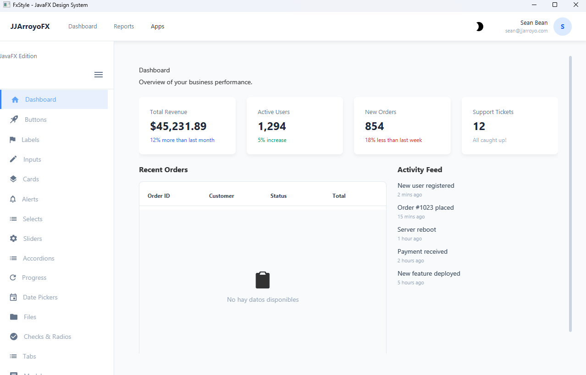
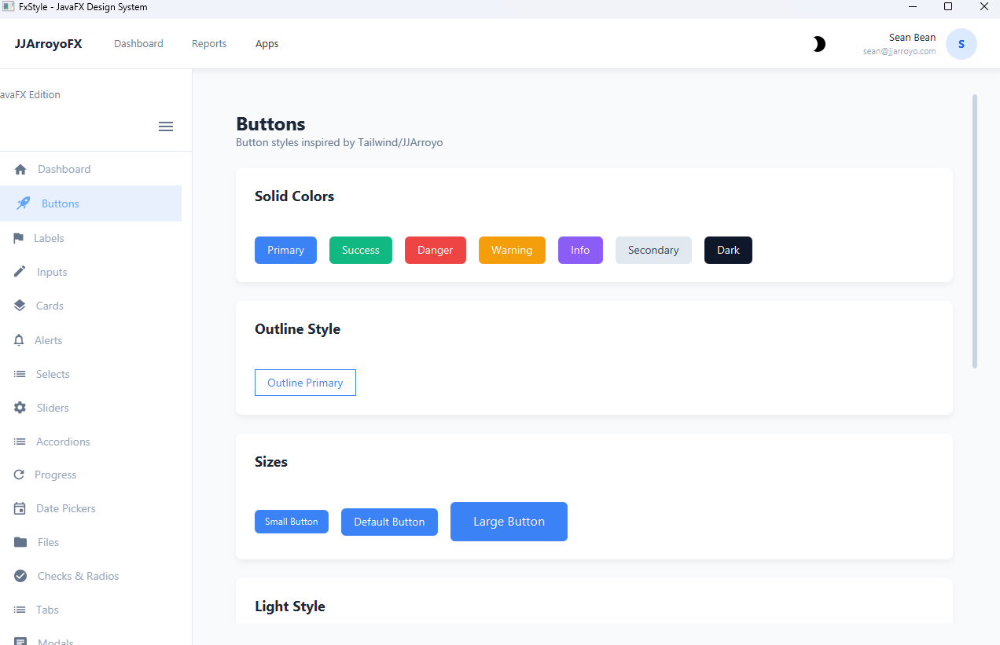
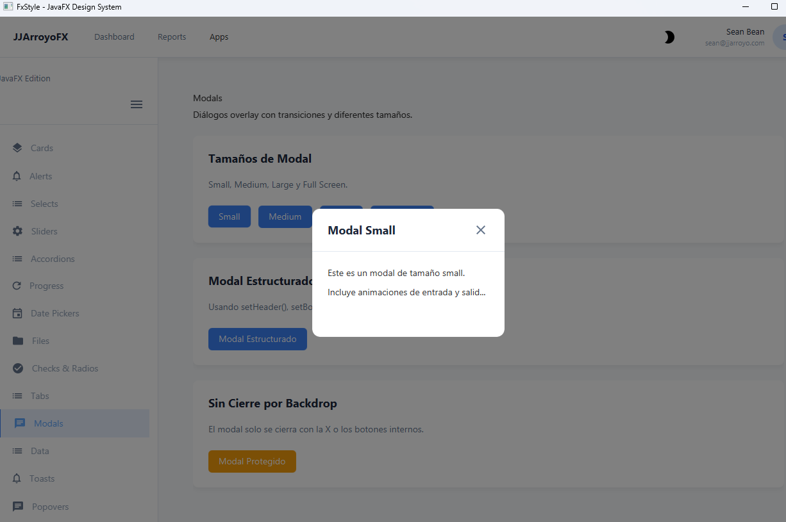
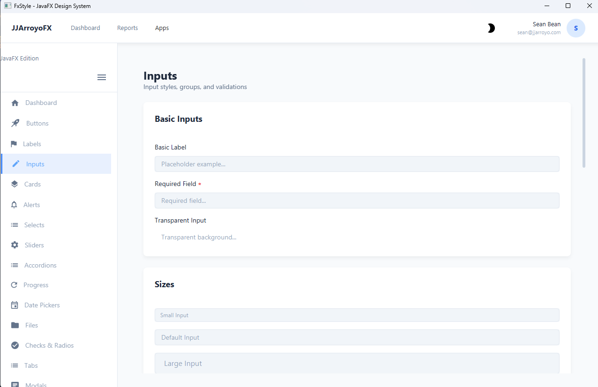
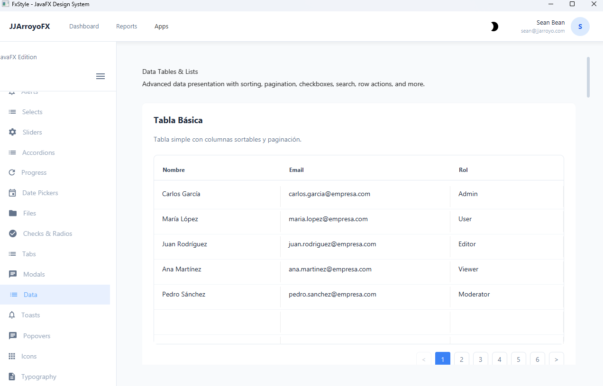
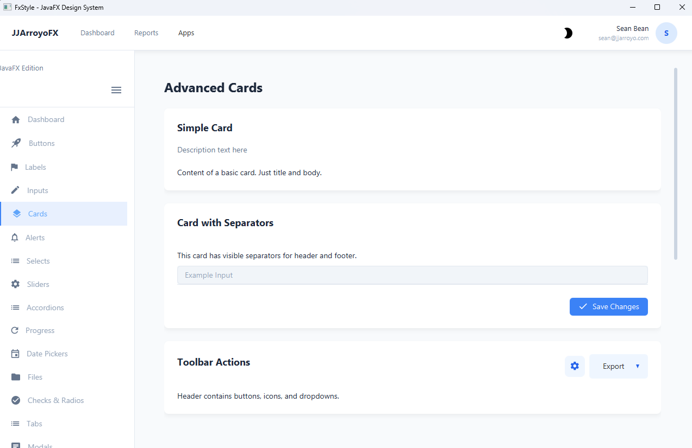
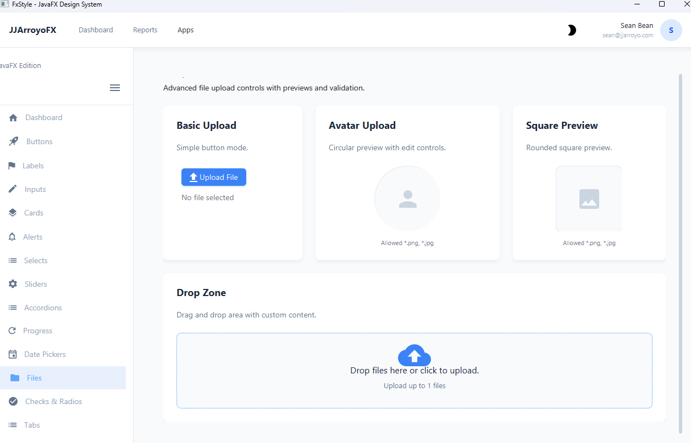
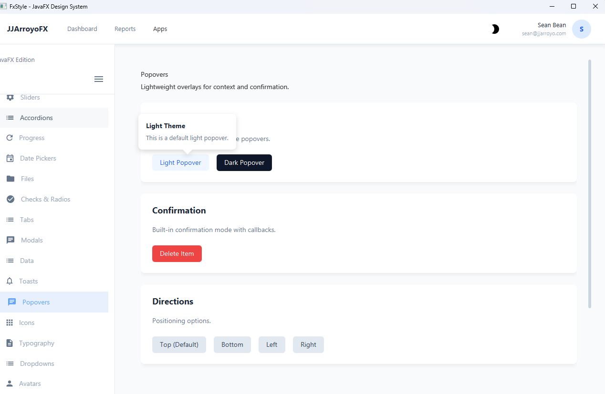
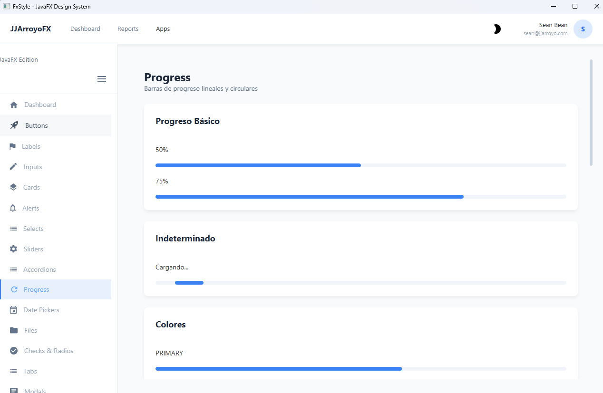
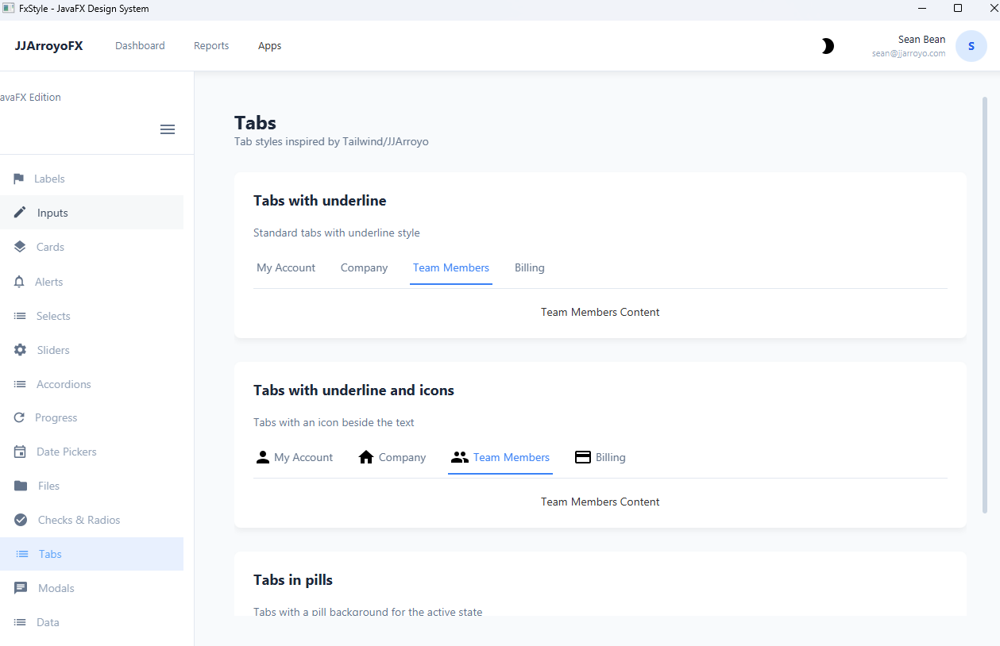
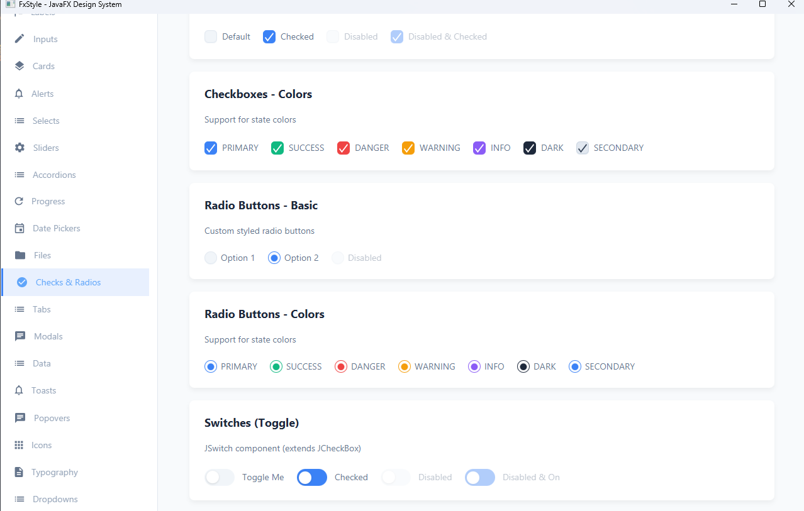
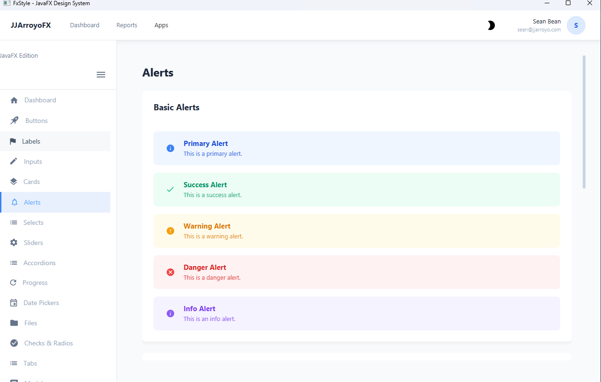
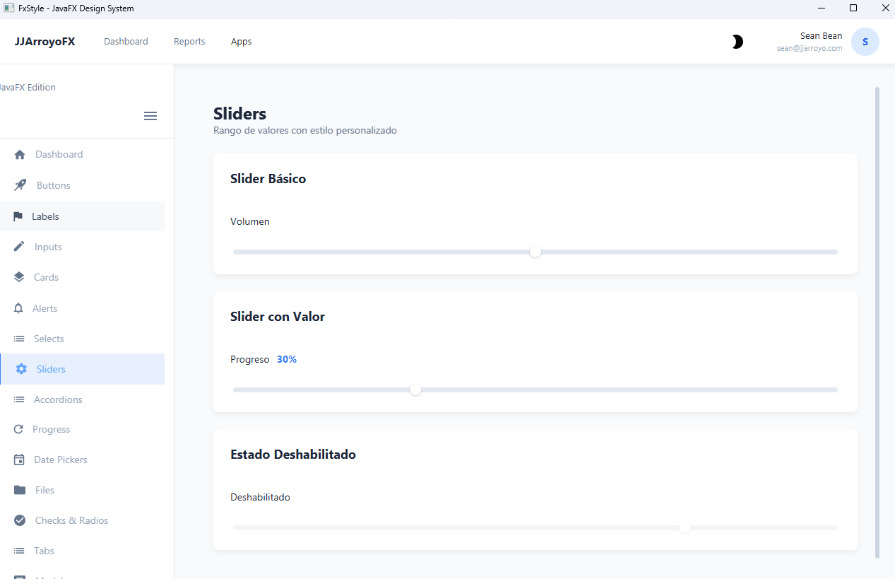

## Problemas comunes

1. Error "mvn no se reconoce": revisa que Maven este en fxstyle/maven/apache-maven-3.9.12 o corrige run.bat.
2. Error con Java: valida JAVA_HOME y que apunte a un JDK (no solo JRE).
3. Error JavaFX: valida que exista E:\Java\javafx-sdk-26\lib o actualiza JAVAFX_PATH.

## Licencia

[MIT](LICENSE)
